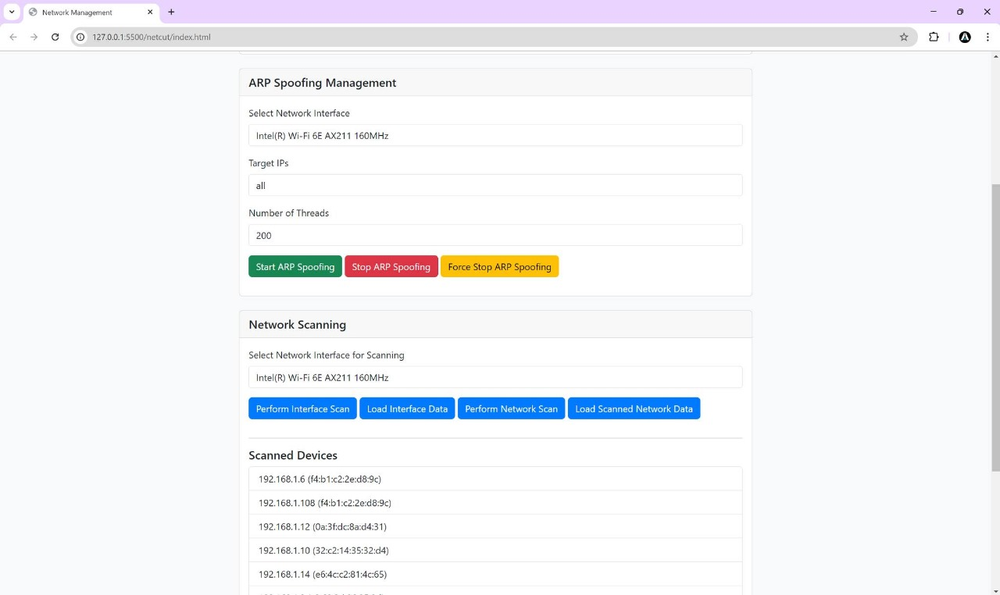

# NetCut-like API


NetCut-like API is a Python-based application built with Flask to manage ARP spoofing, network scanning, and IP whitelisting on a local network. This application allows you to perform network scans, start ARP spoofing attacks, manage whitelisted IPs, and more. It also provides a web-based dashboard for easy management.

## Table of Contents

- [Features](#features)
- [Requirements](#requirements)
- [Installation](#installation)
- [Usage](#usage)
  - [Running the Application](#running-the-application)
  - [Accessing the Dashboard](#accessing-the-dashboard)
  - [API Endpoints](#api-endpoints)
  - [Web Dashboard Functionality](#web-dashboard-functionality)
- [Notes](#notes)
- [License](#license)

## Features

- **ARP Spoofing**: Start and stop ARP spoofing attacks on a specified network.
- **Network Scanning**: Scan the local network to discover devices and their MAC addresses.
- **IP Whitelisting**: Add and remove IPs from a whitelist to exclude them from ARP spoofing.
- **Web-based Dashboard**: Manage all features from a simple web interface.
- **CORS Enabled**: Cross-Origin Resource Sharing is enabled for ease of use.

## Requirements

- Python 3.x
- Flask
- Flask-CORS
- Scapy
- WMI (for Windows)
- Netifaces
- Threading
- JSON

## Installation

1. **Clone the Repository**:
   ```bash
   git clone https://github.com/zimibot/Spoofing_Network.git
   cd netcut-like-api
   
2. **Install the Required Dependencies:**:
   ```bash
   pip install -r requirements.txt
   
3. **Usage:**:
   ```bash
    python api.py
   